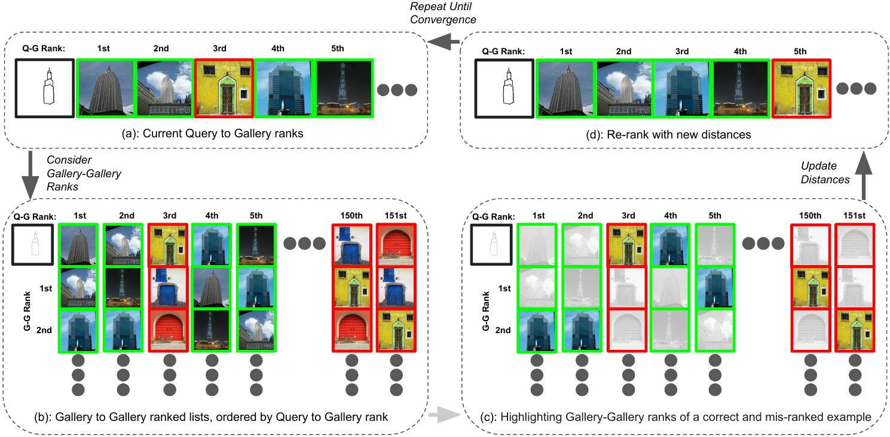

# Iterative Cluster-free Re-ranking (ICFRR)

[Finlay GC Hudson](https://finlay-hudson.github.io), [William AP Smith](https://www-users.york.ac.uk/~waps101/)

University of York

[Paper](https://arxiv.org/abs/2303.17703) | [Project Page](https://finlay-hudson.github.io/icfrr/)


This repository contains the implementation of Iterative Cluster-free Re-ranking (ICFRR) for refining image retrieval
results. While it does not include model training code, it supports running ICFRR using either our pretrained models or
custom user models.

The approach involves a query image from domain A and a gallery of images from domain B. These images are processed
through a feature extractor, generating an initial ranking based on similarity between the query and each gallery image.
However, direct visual features alone may not always establish meaningful connections (as shown in Fig. 1 of our paper).
Instead, a semantic link is often required—this is where ICFRR comes into play, enabling more effective re-ranking.



## Setup

Clone this repository

Make venv in preferred format - for instruction venv will be shown

```
python3 -m venv icfrr_venv
source icfrr_venv/bin/activate
pip install -r requirements.txt
```

If using your own model, install any additional dependencies. If using our pretrained model, install the required
package:

```
pip install timm
```

### Datasets 
Datasets can be downloaded from this [Google Drive link](https://drive.google.com/drive/folders/1eOtrb6b2TH8ljk-usCFOIixlx36HQYz0?usp=sharing)
The original datasets are licenced with [CC BY 4.0](https://creativecommons.org/licenses/by/4.0/) and the original dataset websites are:
- [TU-Berlin](https://cybertron.cg.tu-berlin.de/eitz/projects/classifysketch/)
- For Sketchy I could not locate the original page so have linked to [Original Paper](https://dl.acm.org/doi/10.1145/2897824.2925954), [Extended Paper](https://ieeexplore.ieee.org/document/8099730) 

Once download please extract the zip files into your chosen _data_root_

### Pretrained Models 
We provide the pretrained models described in our [paper](https://arxiv.org/abs/2303.17703). 
They can be downloaded from this [Google Drive link](https://drive.google.com/drive/folders/1Uu-Y9ew6QVBw8BjJhaH-IgnXRSEUSH7g?usp=sharing)
Once downloaded, their root dir should be set as `pretrained_root` (mentioned in arguments below).

## Running

We provide different running options according to use-case

Shared arguments between all running files:

```
--batchsize # batchsize to use
--gpu_id # gpu id to use
--per_class # number of ims per class (-1 is all)
--dataset # dataset to use
--data_root # Parent directory of all datasets
--debug # enable debug mode
--cache-root # Parent directory to store caches
```

## Running Model for Feature Distances

### Running through our model

Run: `src/run_through_model.py`

Args:

```
--pretrained_root # Parent directory of all pretrained model checkpoints
--no_cache #whether to cache data
--force_cache # whether to force recalculation and caching of data
```

### Running with your own model

You need to generate the features in our cacher format, with these components:

- `qg_dists` `(torch.Tensor)`: of shape `[len(query), len(gallery)]` Created
  with `torch.cdist(features["query"], features["gallery"])`. The Euclidean distance between each query and all gallery
  images.
- `gg_dists` `(torch.Tensor)`: which is of shape `[len(gallery), len(gallery)]`. Created
  with `torch.cdist(features["gallery"], features["gallery"])`. The Euclidean distance between each gallery image to all
  gallery images.
- _OPTIONAL_: `labels` `dict`: dict of keys _query_ and _gallery_ each with the integer labels of class. Can be `None`
  if no ground truth

```
from src.icfrr.cache_utils import Cacher

cacher = Cacher(<OUT_DIR_PATH>)
write_caches(qg_dists, gg_dists, labels)
```

### Running IFCRR

Run `src/rerank.py`

Args:

```
--KG # limit of how many of domB to domB we are counting as a strong match
--KQ # how many of domA-domB matches we count as strong
--beta # factor of effect of the rerank
--n_times # how many times to run the reranking
--limited_memory # If you have limited memory, try enabling this to chunk up some operations
--cpu_as_metric_device # to calculate metrics of huge datasets, sometimes cpu memory is larger so should be used
# Results permuting and visualisation
--rerank_results_dir # Directory to store reranking results
--query_idxs_to_vis # Idxs of the query ids for reranking visualisation, if left blank no visualisation occurs
--num_gallery_ims_to_vis # If visualising with query_idxs_to_vis, how many of the top query-gallery results to see
```

## Quickstart - Example Run

We provide query-gallery (qg) and gallery-gallery (gg) dists as well as some ground truth class labels in `examples` to
showcase the running of our `rerank.py` file.

`python src/rerank.py --dataset custom --cache_root examples --data_root examples/custom --n_times 20 --KG 10 --KQ 15 --rerank_results_dir examples/vis --query_idxs_to_vis 0`

## Running TuBerlin

### Get feature distance, either using your own model or ours with:
`python src/run_through_model.py --dataset tuberlin`
_Note: check the args listed to change data directories, cache directories etc_

### Then running ICFRR - with visualisation outputs
`python src/rerank.py --dataset tuberlin --limited_memory --KG 512 --KQ 512`

## Running Sketchy

### Get feature distance, either using your own model or ours with:
`python src/run_through_model.py --dataset sketchy_zs2`
_Note: check the args listed to change data directories, cache directories etc_

### Then running ICFRR - with visualisation outputs
`python src/rerank.py --dataset sketchy_zs2 --limited_memory --KG 125 --KQ 100`
